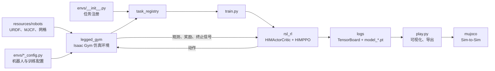

# HIMLoco-for-Go2W

本项目基于 [HIMLoco](https://github.com/OpenRobotLab/HIMLoco)、[legged_gym](https://github.com/leggedrobotics/legged_gym) 和 NVIDIA Isaac Gym，用于四足/轮足机器人的强化学习训练。

当前已注册的任务：

| 任务名 | 机器人 | 自由度 | 资源格式 | 日志目录 |
| --- | --- | ---: | --- | --- |
| `go2w` | Go2W 轮足机器人 | 16 | URDF、MJCF | `logs/GO2W/` |
| `zgwt` | ZGWT 轮足机器人 | 16 | URDF | `logs/ZGWT/` |
| `zgwt_dance` | ZGWT 固定位置姿态/舞蹈任务 | 16 | URDF、MJCF | `logs/ZGWT_DANCE/` |

## 一、框架主要组成及关系

项目可以分为四层：

1. **机器人资源层**：保存 URDF、MJCF 和网格，描述几何、质量、惯量、关节及碰撞体。
2. **仿真环境层**：`legged_gym` 使用 Isaac Gym 并行创建环境，计算观测、奖励、终止条件和控制力矩。
3. **强化学习层**：`rsl_rl` 使用 HIM-PPO 采集经验，并更新策略、价值网络和环境信息估计器。
4. **验证部署层**：`play.py` 加载 checkpoint、可视化并导出策略，`mujoco/` 用于 Sim-to-Sim 验证。



一次训练的实际调用链：

```text
train.py
  ├─ 导入 legged_gym.envs
  │    └─ envs/__init__.py 将任务注册到 task_registry
  ├─ task_registry.make_env(task)
  │    ├─ 读取环境配置
  │    ├─ 加载 URDF
  │    └─ 创建 Isaac Gym 并行环境
  ├─ task_registry.make_alg_runner(...)
  │    └─ 创建 HIMOnPolicyRunner、HIMPPO 和 HIMActorCritic
  └─ runner.learn(...)
       ├─ 策略输出动作
       ├─ 环境返回观测、奖励和终止信号
       ├─ PPO 与 HIM Estimator 更新
       └─ 保存 TensorBoard 日志和 model_*.pt
```

## 二、目录结构

```text
HIMLoco-for-Go2W/
├── legged_gym/                 # 仿真环境、任务配置和入口脚本
│   ├── envs/
│   │   ├── __init__.py        # 任务注册入口
│   │   ├── base/              # 所有机器人的共享环境和配置
│   │   ├── go2w/              # Go2W 任务
│   │   └── zgwt/              # ZGWT 任务
│   ├── scripts/
│   │   ├── train.py           # 训练入口
│   │   └── play.py            # 加载、可视化和策略导出
│   └── utils/                  # 注册器、地形、日志和工具函数
├── rsl_rl/                     # 仓库内置强化学习算法
│   └── rsl_rl/
│       ├── algorithms/         # PPO、HIMPPO
│       ├── modules/            # Actor-Critic、HIM Estimator
│       ├── runners/            # 训练循环
│       └── storage/            # Rollout 数据
├── resources/robots/           # URDF、MJCF 和网格资源
├── logs/                       # checkpoint、事件日志和导出策略
├── mujoco/                     # MuJoCo Sim-to-Sim 验证
└── setup.py                    # legged_gym 安装入口
```

### 1. `legged_gym/envs/base`：共享仿真逻辑

- `base_config.py`：配置基类。
- `base_task.py`：Isaac Gym 环境接口和 viewer 生命周期。
- `legged_robot_config.py`：环境、地形、控制、奖励、随机化和 PPO 的默认参数。
- `legged_robot.py`：核心环境，负责创建仿真、加载资产、计算观测和奖励、执行控制、重置及域随机化。

具体机器人类通常只继承 `LeggedRobot`，机器人差异主要放在对应的 `*_config.py` 中。

### 2. 机器人任务配置

| 配置块 | 作用 |
| --- | --- |
| `env` | 并行环境数、单步/历史观测维度、动作维度 |
| `terrain` | 地形类型、摩擦和地形比例 |
| `commands` | 期望线速度、横向速度和偏航速度范围 |
| `init_state` | 机身初始状态和关节默认角度 |
| `control` | 控制模式、PD 增益、动作及轮速缩放 |
| `asset` | URDF 路径、足端/轮关节名称和碰撞规则 |
| `rewards` | 速度跟踪、姿态、碰撞、力矩和动作平滑奖励 |
| `domain_rand` | 摩擦、负载、质心、电机和外力随机化 |
| `runner` | 训练步数、迭代数、保存间隔和实验名称 |

配置中的关节名和刚体名必须与 URDF 完全一致且区分大小写。动作维度、默认角度数量必须与可驱动关节数量一致。

### 3. `rsl_rl`：HIM-PPO

- `HIMActorCritic`：Actor 使用当前观测、估计速度和隐变量输出动作；Critic 使用特权观测估计状态价值。
- `HIMEstimator`：从多帧观测历史中估计机身线速度和环境隐变量。
- `HIMPPO`：完成 PPO clipped objective、价值函数、熵正则和自适应学习率更新，同时训练 Estimator。
- `HIMRolloutStorage`：保存 rollout 中的观测、动作、奖励和终止状态。
- `HIMOnPolicyRunner`：连接环境与算法，控制采样、更新、日志和 checkpoint。

```text
历史观测 ──> HIM Estimator ──> 估计速度 + 环境隐变量 ──┐
当前观测 ─────────────────────────────────────────────┼─> Actor ─> 动作
特权观测 ─────────────────────────────────────────────└─> Critic ─> 状态价值
```

训练时 Critic 可以使用额外的仿真真值；部署时 Actor 只依赖机器人能够获得的观测历史。

## 三、环境安装

项目依赖本地安装的 NVIDIA Isaac Gym Preview 4。当前使用的环境组合为 Python 3.8、PyTorch 1.13.1 和 CUDA 11.7。

假设 Isaac Gym 位于 `~/PROJECT/RL/isaacgym`：

```bash
conda activate jitou
cd ~/PROJECT/RL/HIMLoco-for-Go2W

python -m pip install -e ~/PROJECT/RL/isaacgym/python --no-deps
python -m pip install -e ./rsl_rl --no-deps
python -m pip install -e . --no-deps
```

检查实际导入路径：

```bash
python -c "import isaacgym, legged_gym, rsl_rl; print(isaacgym.__file__); print(legged_gym.__file__); print(rsl_rl.__file__)"
```

`legged_gym` 和 `rsl_rl` 必须指向当前 `HIMLoco-for-Go2W` 仓库，否则本地任务注册和修改不会生效。

## 四、训练

建议从项目根目录执行。

```bash
# Go2W
python legged_gym/scripts/train.py --task=go2w

# ZGWT
python legged_gym/scripts/train.py --task=zgwt

# ZGWT 原地舞蹈跟踪（yaw rate、roll、pitch、body height）
python legged_gym/scripts/train.py --task=zgwt_dance

# 新机器人初次验证时减少并行环境
python legged_gym/scripts/train.py --task=zgwt --num_envs=16
```

常用参数：

| 参数 | 含义 |
| --- | --- |
| `--task` | 已注册任务名 |
| `--num_envs` | 覆盖并行环境数量 |
| `--max_iterations` | 覆盖最大训练迭代数 |
| `--seed` | 随机种子 |
| `--sim_device` | Isaac Gym 仿真设备 |
| `--rl_device` | 强化学习设备，如 `cuda:0` |

训练输出：

```text
logs/<实验名称>/<时间_运行名称>/
├── events.out.tfevents...
├── model_0.pt
├── model_1000.pt
└── ...
```

> 注意：当前 `train.py` 会把 `args.resume` 强制设为 `False`，所以直接添加 `--resume` 不会恢复训练。断点续训前需要移除该强制赋值，再使用 `--resume --load_run ... --checkpoint ...`。

## 五、查看训练状态与播放模型

### TensorBoard

```bash
tensorboard --logdir logs/ZGWT --port 6006
# 或
tensorboard --logdir logs/GO2W --port 6006
```

浏览器访问 `http://localhost:6006`。TensorBoard 只读取日志，适合训练期间观察奖励、episode 长度、损失和策略噪声。

### `play.py`

自动加载该任务最新运行中的最新 checkpoint：

```bash
python legged_gym/scripts/play.py --task=zgwt --num_envs=1

# 舞蹈策略（play.py 中可设置 yaw_vel/body_roll/body_pitch/body_height）
python legged_gym/scripts/play.py --task=zgwt_dance --num_envs=1
```

`play.py` 的自动舞蹈轨迹包含 yaw rate，并默认从训练配置读取 yaw、roll、pitch
和 body height 的完整命令范围；手动测试固定 yaw 时可将
`dance_trajectory=False` 后设置 `yaw_vel`。

加载指定 checkpoint：

```bash
python legged_gym/scripts/play.py \
  --task=zgwt \
  --num_envs=1 \
  --load_run=Jun24_15-49-31_ \
  --checkpoint=1000
```

`play.py` 只能读取已经保存的 `model_*.pt`，不能读取训练进程内尚未保存的模型。训练和播放同时占用同一 GPU 可能导致显存不足或训练变慢。

脚本当前默认发送 `x_vel=1.0`、`y_vel=0.0`、`yaw_vel=0.0`。如需改变测试指令，可修改 `play.py` 最后一行的调用参数。

## 六、策略导出与 MuJoCo 验证

`play.py` 中默认设置 `EXPORT_POLICY = True`。成功加载 checkpoint 后，策略会导出到：

```text
logs/<实验名称>/exported/policies/
```

运行 MuJoCo 前修改 `mujoco/config.yaml` 中的场景、策略路径、关节顺序、轮关节索引、默认角度、PD 增益和缩放参数：

```bash
cd mujoco
python pdandrl.py

# ZGWT 舞蹈策略：使用零移动速度和默认平滑正弦姿态轨迹
python pdandrl.py --config config_zgwt_dance.yaml
```

| 按键 | 功能 |
| --- | --- |
| `W` / `S` | 前进 / 后退 |
| `A` / `D` | 左移 / 右移 |
| `Q` / `E` | 左转 / 右转 |
| `Space` | 重置零状态 |

目前 MuJoCo 配置和 MJCF 资源主要面向 Go2W。ZGWT 进行 Sim-to-Sim 前，需要准备对应 MJCF/场景，并同步关节顺序、默认角度、控制增益和观测定义。

## 七、添加新机器人

1. 将 URDF 和网格放入 `resources/robots/<robot_name>/`。
2. 检查质量、惯量、关节轴、限制、碰撞体和网格相对路径。
3. 在 `legged_gym/envs/<task_name>/` 创建机器人类和配置。
4. 设置动作/观测维度、默认关节角、PD 参数、足端和碰撞名称。
5. 在 `legged_gym/envs/__init__.py` 中注册任务。
6. 使用少量环境验证加载、初始姿态、关节方向、接触和奖励。
7. 验证无误后增加环境数正式训练。

最小注册形式：

```python
from legged_gym.envs.my_robot.my_robot_config import MyRobotCfg, MyRobotCfgPPO
from legged_gym.envs.my_robot.my_robot import MyRobot

task_registry.register("my_robot", MyRobot, MyRobotCfg(), MyRobotCfgPPO())
```

## 八、常见问题

### `Task with name ... was not registered`

通常是 Python 导入了另一个同名仓库：

```bash
python -c "import legged_gym; print(legged_gym.__file__)"
```

### `ModuleNotFoundError: No module named 'isaacgym'`

Isaac Gym 需要在当前 Conda 环境中单独安装：

```bash
python -m pip install -e ~/PROJECT/RL/isaacgym/python --no-deps
```

### 新机器人生成后翻倒或关节反折

优先检查初始高度、默认关节角符号、左右腿方向、PD 名称匹配、足端/轮关节识别，以及 URDF 的质量、惯量和碰撞体。

### 已知问题

MuJoCo 站立阶段的 PD 控制当前只跟踪最终目标，没有完整跟踪插值曲线。必要时可以按 `Space` 重置。更完整的 Sim-to-Sim 和真机部署流程可参考 [rl_sar](https://github.com/fan-ziqi/rl_sar)。

## 九、参考项目

- [HIMLoco](https://github.com/OpenRobotLab/HIMLoco)
- [legged_gym](https://github.com/leggedrobotics/legged_gym)
- [rsl_rl](https://github.com/leggedrobotics/rsl_rl)
- [rl_sar](https://github.com/fan-ziqi/rl_sar)
